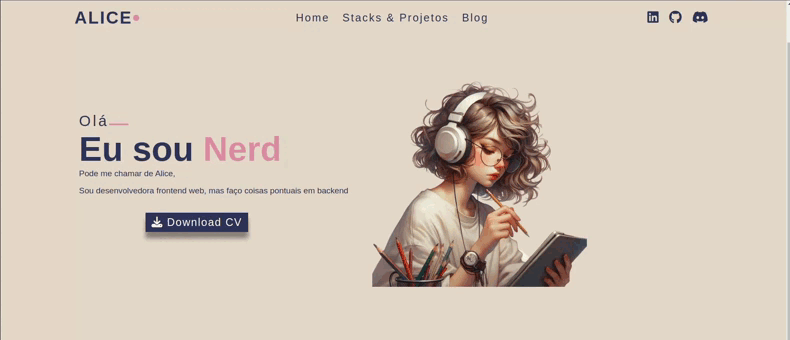
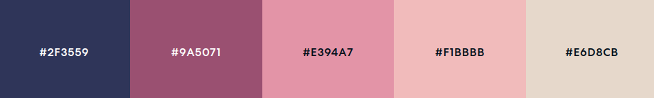

# Portfólio

## 🛠 Tecnologias

As seguintes ferramentas foram usadas na construção do projeto:

#### **Web**  ([HTML](https://developer.mozilla.org/en-US/docs/Web/HTML)  +  [CSS](https://developer.mozilla.org/en-US/docs/Web/CSS) + [Javascript](https://developer.mozilla.org/en-US/docs/Web/JavaScript))

#### **Utilitários**

-   Protótipo:  **[Figma](https://www.figma.com/)**  →  **[Protótipo]()**
-   Editor:  **[Visual Studio Code](https://code.visualstudio.com/)**
-   Markdown:  **[StackEdit](https://stackedit.io/)**,  **[Markdown Emoji](https://emojisparacopiar.com/)**
-   Ícones:   **[Font Awesome](https://fontawesome.com/)**
-   Fontes:  **[Poppins](https://fonts.google.com/specimen/Poppins)**,
-   Libs: **[Typed](https://github.com/mattboldt/typed.js/)**

## 🎨 Paleta de cores usada

